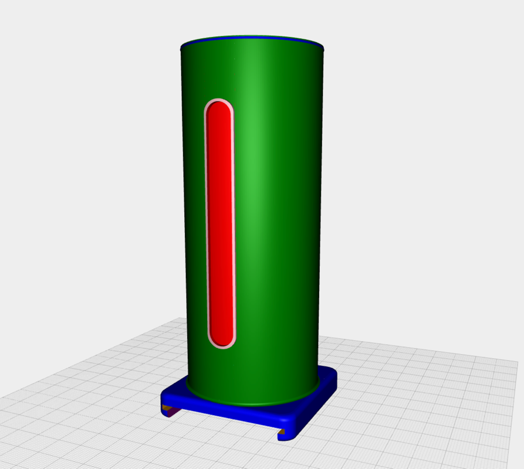
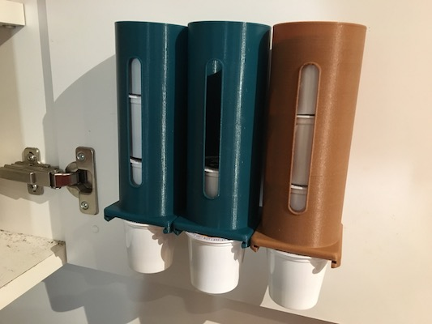

# kcup

> A dispenser for k-cups

# Another one?

While, there are many k-cup dispensers/holders available for download, some are overly complex, and others require a lot of filament (~250g) to print.

Further, I wanted one that would fit on the inside of a cabinet door, between the shelves.

This design prints as one piece, and uses ~35g (4.5m) of PLA for the 3 pod height design.

## Printing

The support disk on the interior of the base.  This is to help bed adhesion and can be discarded after printing.  You can use the [stl](stl/kcup.stl) file included, or open the project on [openjscad.org](http://openjscad.org/#https://raw.githubusercontent.com/johnwebbcole/kcup/master/dist/kcup.jscad) and create your own `stl` file.  The `height` parameter is the number of pods that will fit inside the dispenser.  One will hang below so the total capacity is `height` + 1.

## Development

The jscad project `kcup` uses gulp to create a `dist/kcup.jscad` file and watches your source for changes. You can drag the `dist/kcup.jscad` directory into the drop area on [openjscad.org](http://openjscad.org). Make sure you check `Auto Reload` and any time you save, gulp will recreate the `dist/kcup.jscad` file and your model should refresh.

## jscad-utils

The example project uses [jscad-utils](https://www.npmjs.com/package/jscad-utils). This is a set of utilities that make object creation and alignment easier.

## License

ISC © [John Cole](http://github.com/johnwebbcole)
